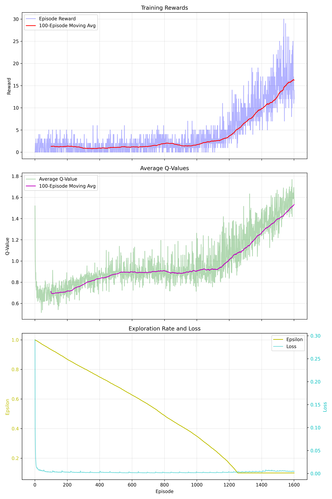
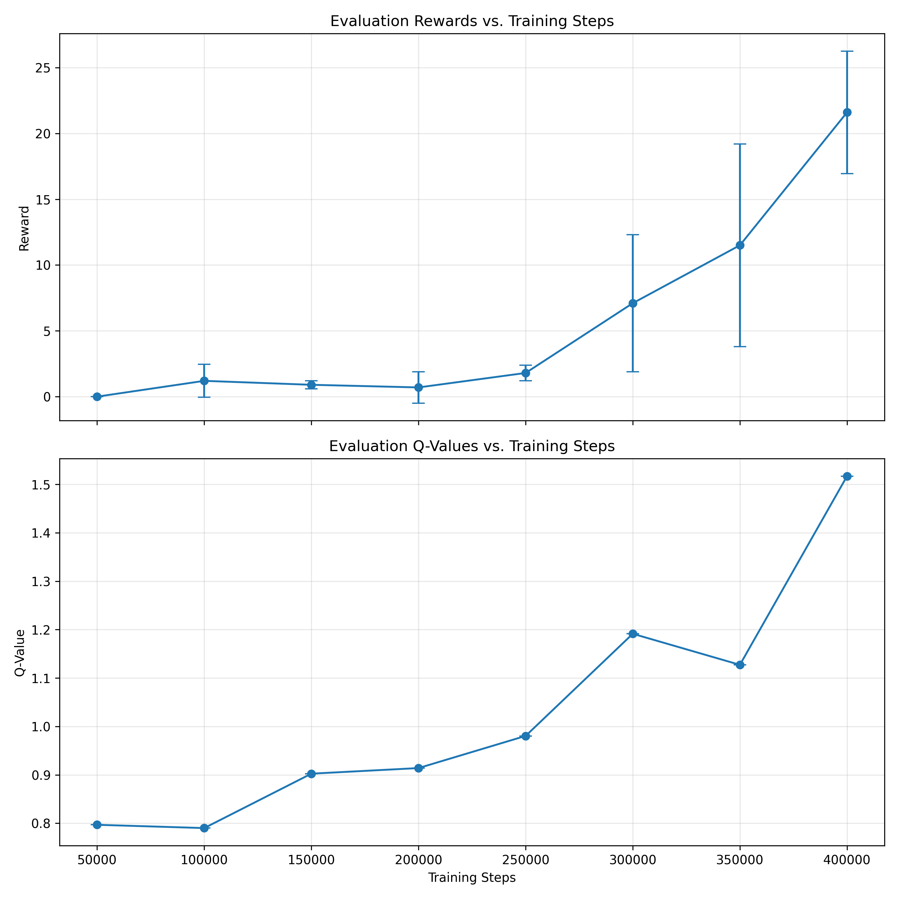
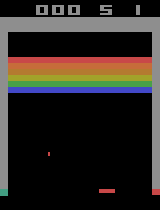

# Deep Q-Learning for Atari Games

This repository contains an implementation of Deep Q-Learning (DQN) for training an agent to play Atari games, specifically focused on Breakout.

## Training Parameters

- **Replay Buffer Capacity**: 1,000,000
- **Batch Size**: 32
- **Learning Rate**: 0.0000625
- **Gamma (Discount Factor)**: 0.99
- **Epsilon Start**: 1.0
- **Epsilon Min**: 0.1
- **Epsilon Decay**: 250,000 steps
- **Target Network Update**: Every 10,000 steps

## Training Metrics

The following metrics were tracked during training:
- **Average Q-values**: Estimated action values from the policy network
- **Average Reward**: Episode rewards over 100-episode windows
- **Training Loss**: Huber loss from TD error
- **Epsilon Values**: Exploration rate decay over time

## Results

The agent was trained for approximately **1600 episodes** on the Breakout environment. Below are the training results and performance visualizations:

### Training Metrics


*Training progress showing loss, rewards, and other training metrics over episodes*

### Evaluation Metrics

*Evaluation results showing Q-values and reward progression during testing*

### Agent Performance

*Trained DQN agent playing Breakout after 1600 episodes of training*

## Implementation

The main DQN implementation can be found in [`DQN.py`](DQN.py), which contains:
- DQN neural network architecture
- Replay buffer implementation
- DQN agent with target network
- Training and optimization logic
- Metric logging system

Configuration parameters are centralized in [`configs.py`](configs.py).

## Current Implementation

The codebase currently includes:

1. **Configuration System**:
   - Centralized hyperparameters in [`configs.py`](configs.py)

2. **DQN Architecture**:
   - Convolutional neural network following the architecture from the DeepMind paper
   - Input preprocessing to convert game frames to 84x84 grayscale images
   - Action selection using epsilon-greedy strategy

3. **Replay Buffer**:
   - Implementation of experience replay buffer to store state transitions
   - Random sampling from buffer for training to break correlations between consecutive samples

4. **Target Network**:
   - Separate target network to stabilize training
   - Periodic update of target network from policy network

5. **Training Components**:
   - Frame stacking (4 frames) to capture temporal information
   - Reward clipping between -1 and 1
   - Huber loss for robust learning
   - RMSProp optimizer

6. **Preprocessing Pipeline**:
   - RGB to grayscale conversion
   - Resizing to 84x84
   - Normalization of pixel values

7. **Training Loop**:
   - Complete training procedure with proper logging
   - Learning rate scheduling
   - Epsilon decay strategy

8. **Model Saving/Loading**:
   - Checkpointing system for models
   - Resume training capability

9. **Evaluation Framework**:
   - Proper testing procedure
   - Performance metrics tracking
   - Video recording of agent gameplay

10. **Visualization**:
    - Training curves and statistics
    - Q-value and reward tracking across episodes


## Usage

### Training the Agent

```bash
python train.py
```


## Requirements

- PyTorch
- OpenAI Gym
- ALE-py (Atari Learning Environment)
- OpenCV (for image preprocessing)
- NumPy

## References

- [Playing Atari with Deep Reinforcement Learning](https://arxiv.org/abs/1312.5602)
