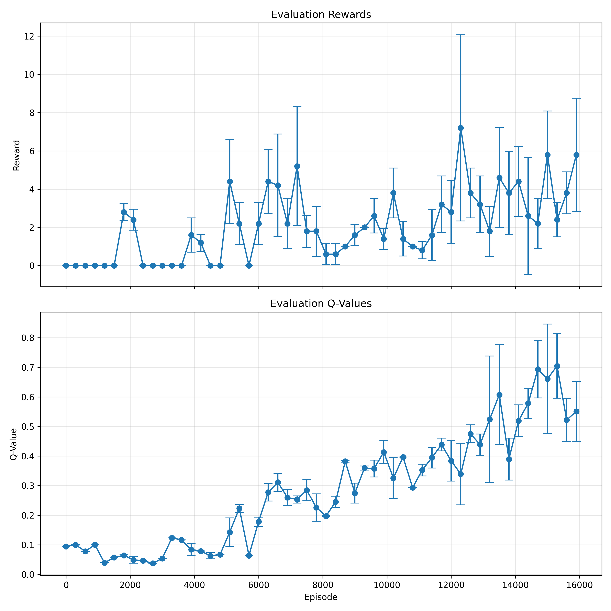

# Deep Q-Learning for Atari Games

This repository contains an implementation of Deep Q-Learning (DQN) for training an agent to play Atari games, specifically focused on Breakout.

## Current Implementation

The codebase currently includes:

1. **DQN Architecture**:
   - Convolutional neural network following the architecture from the DeepMind paper
   - Input preprocessing to convert game frames to 84x84 grayscale images
   - Action selection using epsilon-greedy strategy

2. **Replay Buffer**:
   - Implementation of experience replay buffer to store state transitions
   - Random sampling from buffer for training to break correlations between consecutive samples

3. **Target Network**:
   - Separate target network to stabilize training
   - Periodic update of target network from policy network

4. **Training Components**:
   - Frame stacking (4 frames) to capture temporal information
   - Reward clipping between -1 and 1
   - Huber loss for robust learning
   - RMSProp optimizer

5. **Preprocessing Pipeline**:
   - RGB to grayscale conversion
   - Resizing to 84x84
   - Normalization of pixel values

6. **Configuration System**:
   - Configurable parameters in a central location

7. **Training Loop**:
   - Complete training procedure with proper logging
   - Learning rate scheduling
   - Epsilon decay strategy

8. **Model Saving/Loading**:
   - Checkpointing system for models
   - Resume training capability

9. **Evaluation Framework**:
   - Proper testing procedure
   - Performance metrics tracking
   - Video recording of agent gameplay

10. **Visualization**:
    - Training curves and statistics
    - Q-value and reward tracking across episodes
    
    
    *Projected Q Values and Evaluation Rewards across Episodes*

## Planned Implementations

1. **Extensions**:
   - Double DQN implementation
   - Prioritized Experience Replay
   - Dueling DQN architecture
   - Noisy Networks for exploration
   - Distributional RL (C51)
   - Rainbow DQN (combination of improvements)

2. **Multi-environment Support**:
   - Extending beyond Breakout to other Atari games
   - Environment wrappers for different games

## Usage

### Training the Agent

```bash
python train.py
```


## Requirements

- PyTorch
- OpenAI Gym
- ALE-py (Atari Learning Environment)
- OpenCV (for image preprocessing)
- NumPy

## References

- [Playing Atari with Deep Reinforcement Learning](https://arxiv.org/abs/1312.5602)
- [Human-level control through deep reinforcement learning](https://www.nature.com/articles/nature14236)
